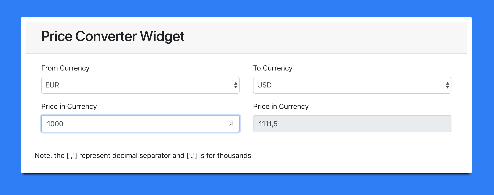
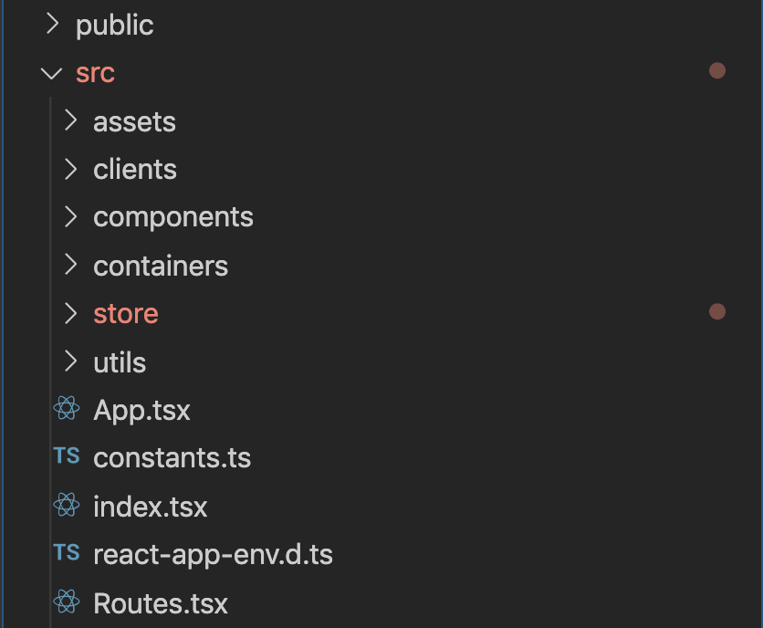

# MEDIKURA-CODE-CHALLENGE

### Problem Statement
In this task, you will build a currency converter that allows you to convert one currency into multiple other currencies. (in React JS)

Requirements:

1. latest exchange rates should be fetched from an API (e.g. https://exchangeratesapi.io/)
2. the user can choose from multiple source currencies (one of EUR, USD, GBP)
3. the user can choose from multiple target currencies (one of EUR, USD, GBP)
4. The user can enter a value in the source currency
the amount in the chosen target currency is immediately displayed as the user is typing (one at a time based on the selection)

### Tech/lib/packages Used

1. `Typescript` = for static  type checking so that we can catch maxium type related error at compile time
2. `Redux` = for managing (global)state  in the applcation
3. `Redux-thunk` = this redux middleware was used for actions dispatching asyncronously
4. `Create-react-app` = for generated seed project with needed configuration
5. `react-bootstrap` = for ui components and bootstrap grid
   
`Note - typscript and redux were not mandatory. Same results can be achieved fastly without them. This is added just to showcase the use of Typescript and Redux for the challenge`

###  Folder Structure

1. `public` = contains index html container in which react app is first bootsraped. Apart from that other files added are favicon, manifest.json(contains info regarding cross device browsers), robots.txt(to control search engine crawler in webapp)
2. `src/assets` = folder to keep styles,icons, images, javascript etc
3. `src/clients` = contains clients for XHRs
4. `src/components` = general  purpose component that can be access from multiple places. these contains functional as well as class components. These components do not contain logic to directly mutate the global state
5. `src/containers`  = these  are components that are connected to the store directly with mapStateToProps and mapDispatchToProps
6. `src/store` = contains redux store & root reducer. Root reducer is a combination of multiple sub reducers that are separated by namespacing. There are store sub modules which contains there own reducer, actions and actionTypes
7. `utils` = contains utility functions. The utility scope is less than servics. They are general purpose function and should not contain any core logic.
8. `src/App.tsx` = main App file that renders in dom container div
9. `src/index.tsx` = entry file
10. `src/Routes.tsx` = contains app routes
  
### Time Spent (Total : 3 days)

1. 1.5 day = typescript with react & redux
2. 0.5 day = discovering best practices (like folder structure, defining typings etc)
3. 1 day = actual implmentation of the components

### (In case of more time) To Do's

1.  attaching redux store directly to the component instead of container in order to prevent the issue of prop drilling or finding a better approach.
2. making the type check more striict
3. adding test cases (unit + e2e)
4. documenting (using typedocs)
5. more styling (using better colors, animations and pictures). Adding styles in SCSS with smacss.
6. adding a date selector (to do the conversion based on rated from a particular date)
7. adding internationalization (multiple languages + showing currency format based on region)
8. adding a story book for documenting UI components
9. ....thinking 🤔 :) J
   
### Workflow

The project is an App that contains a Home Container that contains Price Converter Widget.
On the first load of the page, intial state(containg latest rates) is set in the store

`Price Converter Widget` - It is a class component that calculate the 'to price' based on latest rates. It internally uses a Functional component that displays the drop down and input field based on passed pros

On change of base currency new rates are update inside the store (so a re-render happens in the Home container). This Refresh the  Widget again.

On change of 'to currency' event handler update the 'to price' based on rates

On change of 'from price' event handler update the 'to price' based on rates

## Available Scripts

In the project directory, you can run:

### `npm start`

Runs the app in the development mode with HMR 
Open [http://localhost:3000](http://localhost:3000) to view it in the browser.

### `npm run build`

Builds the app for production to the `build` folder. 
